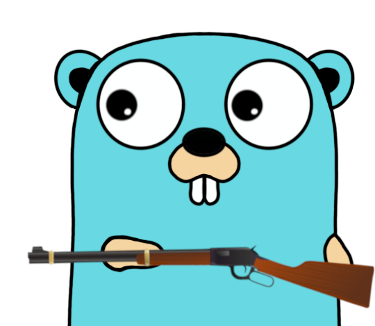

# repeater

 <!-- markdownlint-disable MD033 -->

Repeats `f()` no more than `N` times with interval of `M` until `C` doesn't say the result is successful.

## Usage

See the [example](example.go).

```go
r := repeater.NewRepeater(
    repeater.WithInterval(100*time.Millisecond),
    repeater.WithRetries(5),
)

attempts, err := r.Run(importantFunction)
```

By default, the "success" occurs when function returns `nil` as `error` (`IsNoError` checker). You can change this behavior by adding `WithResultChecker` option (see [pkg/repeater/result_checker.go](pkg/repeater/result_checker.go)).

## Note

Gopher image is generated with [https://quasilyte.dev/gopherkon](https://quasilyte.dev/gopherkon) ([github](https://github.com/quasilyte/gopherkon))

Rifle image is taken from [wikipedia](https://en.m.wikipedia.org/wiki/File:Winchester_rifle.svg)
